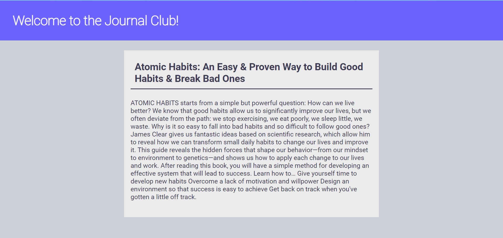

PROJECT TITLE: JOURNAL

TABLE OF CONTENT
-[LICENSE](#LICENSE)
-[DESCRIPTION](#DESCRIPTION)
-[INSTALLATION](#INSTALLATION)
-[USAGE](#USAGE)
-[CONTRIBUTION GUIDELINES](#CONTRIBUTION-GUIDELINES)
-[TESTS](#TESTS)
-[CONTACT INFORMATION](#CONTACT-INFORMATION)
-[PICTURES](#PICTURES)

# LICENSE
MIT License (2023, Ryan Messett). Permission is hereby granted, free of charge, to any person obtaining a copy of this software and associated documentation files (the "Software"), to deal in the Software without restriction, including without limitation the rights to use, copy, modify, merge, publish, distribute, sublicense, and/or sell copies of the Software, and to permit persons to whom the Software is furnished to do so, subject to the following conditions: The above copyright notice and this permission notice shall be included in all copies or substantial portions of the Software.

# DESCRIPTION
This is the code for a Journal application. In this application the user has to sign up using their name, email, password and age; then, they have to login using their email and password. In case the email and password is not correct then the user will receive the message "Failed to login". Once the user has login, he will be presented with a calendar and there he can add different notes and save them to look at them after. 
The user information is stored in the mySQL database, in our case, we use Laragon to administrate and check the data. Sensitive data such as passwords are stored as tokens. 
In the application there is a section where you can read articles about recommended personal growth resources.

# INSTALLATION INFORMATION
  To install all the node dependecies enter npm i, then enter npm start and go to port 4040 in your browser.

# USAGE INFORMATION
  Create an account with your name, email, password and age; fill in the login section and use the calendar to create, save and delete notes.
  At the botton of the page there is a green button, click there to go to the Journal club.

# CONTRIBUTION GUIDELINES
  Carolina Sandoval - Controllers, models, mySQL connection, authentication back-end, and front-end login page and to-do-list page and handleabars.
  Paulina Garza - Front-End to-do-list

# TESTS
  In postman enter routes showed in the server.js document and click enter to test the functionality.

# CONTACT INFORMATION
For further questions reach me on GitHub and by email.
GITHUB: https://github.com/ambersanti1
EMAIL: carolinasandoval879@gmail.com 

# PICTURES

